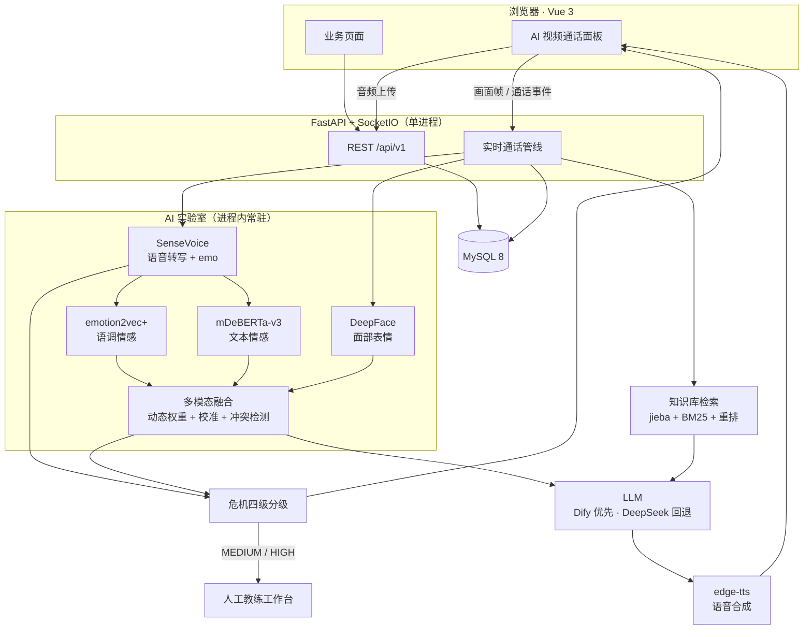

# Faith · 心理教练成长服务平台

> 多模态情绪感知驱动的心理教练智能体 —— AI 陪伴 + 人工教练兜底的混合服务闭环

Faith 是一个面向高校学生与青年人群的心理成长服务平台。
平台用**多模态情绪感知**（语音转写、语调情感、文本情感、面部表情）驱动一个
**五阶段教练状态引擎**，在实时语音 / 视频通话中完成共情、探索、目标澄清与行动规划；
当识别到危机信号时按四级规则分级，并在必要时转入**人工教练接管**流程。

除 AI 能力外，平台还包含完整的服务侧闭环：教练入驻与预约、付费锁定与退款规则、
个案记录与话术库、成长测评与情绪日记、社群与科普内容、管理后台与审计日志、
数据导出与注销删除等合规能力。

---

## 仓库结构

本仓库是两个独立项目合并而成的 monorepo，**两部分的提交历史均完整保留**。

```
Faith/
├── MindBasic-backend/     # FastAPI 后端：REST + SocketIO + AI 实验室
└── MindBasic-frontend/    # Vue 3 前端：用户端 / 教练端 / 管理后台 / AI 通话页
```

| 目录 | 技术栈 | 说明 | 文档 |
| --- | --- | --- | --- |
| [`MindBasic-backend/`](MindBasic-backend/README.md) | Python 3.12 · FastAPI · SQLAlchemy 2 · MySQL 8 · Alembic | REST API、SocketIO 实时管线、多模态分析、危机分级、后台服务 | [后端 README](MindBasic-backend/README.md) |
| [`MindBasic-frontend/`](MindBasic-frontend/README.md) | Node 18+ · Vue 3 · Vite 6 · TypeScript · Tailwind v4 · Pinia | 36 个页面，含 AI 视频通话面板与管理后台 | [前端 README](MindBasic-frontend/README.md) |

两个子项目各有一份 README，覆盖该侧的目录结构、接口契约、环境变量、部署与排障细节。
本文件只做整体说明与端到端启动指引。

---

## 系统架构



后端只有一个 ASGI 应用（`app.main:socket_app`），REST 与 SocketIO 共用它。
AI 模型**懒加载 + 启动后台预热**，四个模型常驻进程内，因此后端必须单 worker 运行
（多 worker 会让模型重复加载并成倍占用内存）。

---

## 技术栈

**后端**

| 组件 | 选型 |
| --- | --- |
| Web 框架 | FastAPI（自动 OpenAPI 文档 `/docs`） |
| 实时通信 | python-socketio（与 FastAPI 共用一个 ASGI 应用） |
| ORM / 迁移 | SQLAlchemy 2.x 异步 + Alembic（24 个迁移版本） |
| 数据库 | MySQL 8（utf8mb4） |
| 认证 | PyJWT + bcrypt，Access / Refresh 双令牌，Refresh 轮换 + httpOnly Cookie |
| 限流 | 内存滑动窗口（默认）/ Redis 固定窗口（多实例） |
| 可观测性 | 结构化日志 + Prometheus `/metrics` + 健康 / 就绪探针 |
| 测试 | pytest（39 个测试文件 / 215 项用例） |

**AI 实验室**

| 模型 / 服务 | 用途 |
| --- | --- |
| SenseVoiceSmall | 语音转写（中文为主，附 emo 标签） |
| emotion2vec+ large | 语调情感（7 类） |
| mDeBERTa-v3-base-mnli-xnli | 文本情感（零样本分类） |
| OpenSMILE eGeMAPSv02 | 语调情感降级通道（emotion2vec 不可用时） |
| DeepFace（mtcnn） | 实时面部表情（SocketIO 抽帧，约 2.5 fps） |
| DeepSeek / Dify | 对话生成（Dify 智能体优先，失败单轮回退 + 熔断降级到 DeepSeek） |
| edge-tts | 语音合成（免费，无需 API Key） |

**前端**

| 组件 | 选型 |
| --- | --- |
| 框架 / 构建 | Vue 3（Composition API）+ Vite 6 + TypeScript |
| 样式 | Tailwind CSS v4（`@theme` 设计令牌，暖米底 + 深紫罗兰主色，含深色模式） |
| 状态 / 路由 | Pinia + Vue Router 4（鉴权守卫 + 页面级懒加载） |
| HTTP / 实时 | axios（Token 注入、401 自动刷新重放）+ socket.io-client |
| 其他 | @phosphor-icons/vue、html-to-image、自研 XSS 安全 Markdown 渲染 |

---

## 快速开始

### 环境要求

| 依赖 | 版本 | 说明 |
| --- | --- | --- |
| Python | 3.12 | 后端 |
| MySQL | 8.0 | 本地或远程均可 |
| Node.js | 18+ | 前端 |
| Redis | 7（可选） | 仅多实例部署或 `RATE_LIMIT_BACKEND=redis` 时需要 |
| 显卡（可选） | — | 有 NVIDIA GPU 时四个模型可跑在 CUDA 上，显著降低延迟与内存占用 |

后端按「业务能力」和「AI 能力」分两层依赖：核心依赖装在 `requirements.txt`，
AI 模型相关的重依赖在 `requirements-ai.txt`。**不装 AI 依赖后端也能正常启动**，
只是语音 / 语调 / 文本情感 / 表情识别会逐条降级，启动日志会给出原因。

### 1. 启动后端

```bash
cd MindBasic-backend

# 创建环境并安装核心依赖
conda create -n relmind-backend python=3.12 -y
conda activate relmind-backend
pip install -r requirements.txt

# 配置环境变量
cp .env.example .env
# 必填：DATABASE_URL、JWT_SECRET_KEY（缺失会启动失败）
# 建议填：DEEPSEEK_API_KEY（不填则 AI 教练接口返回 503）

# 建库并执行迁移（含种子数据：初始管理员、模板、话术库、社群、测评量表）
mysql -uroot -p -e "CREATE DATABASE IF NOT EXISTS mindbasic DEFAULT CHARACTER SET utf8mb4 COLLATE utf8mb4_unicode_ci;"
alembic upgrade head

# 可选：写入演示数据
python scripts/demo_seed.py

# 启动（必须走 socket_app，REST 与实时管线共用它）
python scripts/run_dev.py
```

启动后：

| 地址 | 用途 |
| --- | --- |
| `http://127.0.0.1:8000/docs` | OpenAPI 文档 |
| `http://127.0.0.1:8000/health` | 健康检查 |
| `http://127.0.0.1:8000/health/ready` | 就绪探针（含数据库连通性） |
| `http://127.0.0.1:8000/metrics` | Prometheus 指标 |
| `http://127.0.0.1:8000/api/analyze_audio/config_check` | 四个 AI 模型的加载状态 |

> 初始管理员：`13800138000 / Admin@123456`（首次登录后请修改）。

### 2. 启动前端

```bash
cd MindBasic-frontend
npm install
npm run dev     # http://127.0.0.1:5173
```

开发服务器会把 `/api` 与 `/socket.io` 代理到 `127.0.0.1:8000`（含 WebSocket 升级），
所以前后端必须同时运行。

### 3. 可选：启用 AI 实验室

```bash
cd MindBasic-backend
pip install -r requirements-ai.txt
# torch / tensorflow 体积大，按平台单独安装（见下方注意事项）
python scripts/build_kb_index.py   # 构建知识库检索索引（需自备语料，见下文）
```

安装完成后**重启后端**，模型会在后台自动预热；用 `config_check` 确认四个模型均为
`loaded` 再开始通话，否则第一轮转写会因加载模型而超时。

> **Windows + NVIDIA 30/40/50 系显卡的注意事项**
>
> PyPI 上的 `torch` 在 Windows 是 **CPU 版**，装出来 `torch.cuda.is_available()`
> 为 `False`。要启用 GPU 必须从 PyTorch 官方源安装 CUDA 构建：
>
> ```bash
> pip install torch torchaudio --index-url https://download.pytorch.org/whl/cu128
> ```
>
> 注意两点：**不要同时指定 `--extra-index-url`**，否则 pip 可能把 `torch` 从 PyPI 解成
> CPU 版、把 `torchaudio` 从 CUDA 源解出来，两者版本错配会在导入时报
> `libtorchaudio.pyd` 加载失败；另外 Blackwell 架构（RTX 50 系，算力 sm_120）
> 必须用 **cu128 及以上**的构建，早期的 cu121 / cu124 轮子里没有对应内核。

---

## 核心流程：一轮 AI 视频通话

理解这一条链路就理解了平台的核心。用户按住说话 → 松开后：

1. **音频上传**：前端把音频 Blob 传 `POST /api/vc_audio_upload` 拿到 `file_id`，
   再用 `vc_audio_end` 通知后端（走 HTTP 上传而非 socket 分片，避免乱序）。
2. **语音转写**：SenseVoice 输出文本与 emo 标签。
3. **并发多模态分析**：语调情感（emotion2vec，失败自动降级 OpenSMILE）与
   文本情感（mDeBERTa 零样本）并行计算；知识库检索同时发起，互不阻塞。
4. **融合**：`fusion_service` 把文本 / 语调 / 面部三路结果融合成情绪与置信度。
   权重按启发式动态调整（某路缺失则权重归零、稳定性差的减半、置信度低的降权），
   并输出模态间的**线索冲突度量**与是否需要澄清。
5. **阶段判定**：`coach_stage_service` 依据对话状态在
   `opening → exploration → goal_setting → action_planning → closing`
   五个阶段间推进，允许回退；判定结果回传给 LLM 作为生成约束。
6. **风险分级**：`crisis_rules` 独立于模型做确定性判定，输出
   `NONE / LOW / MEDIUM / HIGH`；`MEDIUM` 及以上建档并通知值班人员。
7. **生成回复**：优先调用 Dify 智能体，任一轮失败当场回退 DeepSeek，
   连续失败 3 轮熔断 120 秒；流式返回 token。
8. **语音合成**：edge-tts 分句合成并流式下发给前端播放，用户可随时打断。
9. **留痕**：整轮的阶段、风险、各段耗时写入 `multimodal_analysis_records`，
   与 `ai_conversations` 关联；通话结束后可生成阶段总结草稿，
   用户确认后写入情绪日记。

其中「判定」与「生成」是刻意分离的：阶段判定、风险分级、融合规则都留在本仓库，
可单测、可复现、可做错误分析，换掉 LLM 也不会改变口径。

---

## 关键设计

### 多模态融合：把"感知"变成可复核的输出

融合不只输出一个情绪标签，还输出**为什么**这么判：

| 输出 | 含义 |
| --- | --- |
| `weights_used` | 本次三路模态实际使用的权重 |
| `weight_adjustments` | 权重调整的原因（如"无面部帧 → 面部权重归零""文本置信度低 → 降权 30%"） |
| `conflict` | 模态间 JS 散度、冲突等级、是否需要先澄清 |
| `calibration` | 温度缩放校准的状态与来源 |

这意味着"线索冲突时先提问确认"是算法输出的结论，而不是写死的产品话术。
原始最大概率默认不当作置信度使用——需要先用真实标注数据跑
`experiments/run_calibration.py` 标定温度，再通过 `FUSION_CALIBRATION_*` 开启。

### 危机分级：视觉信号不单独触发工单

| 等级 | 触发条件（摘要） | 系统响应 |
| --- | --- | --- |
| `HIGH` | 明确的自伤 / 自杀表达，或"指向本人的强负性表达 + 计划 / 时点线索" | 建档 + 通知值班人员 + 下发紧急求助提示 |
| `MEDIUM` | 指向本人的强负性表达（无望、自我否定、撑不住） | 建档 + 通知值班人员 + 下发关怀提示 |
| `LOW` | 出现风险语汇但被否定、假设、转述、口语夸张或缓解语境削弱 | 不建档、不打扰用户，仅留痕与统计 |
| `NONE` | 未命中任何规则 | — |

两条刻意设下的边界：**多模态一致负性信号最多把等级提升到 `LOW`，永远不能单独触发
工单**（视觉信号只用于留痕与对话策略，不用于对用户下结论）；同一用户同一来源
10 分钟内去重，等级升高时升级工单并留痕。

### AI 与人工教练的混合服务

平台不是"AI 陪聊"，而是 AI 与真人教练共同履约：

- AI 侧负责随时可用的自助陪伴与情绪记录；
- 触发风险或用户主动求助时，转入教练工作台的接管流程（队列 / 接管 / 跟进 / 结案 / 时间线留痕）；
- 教练侧有完整的商业闭环：入驻审核、服务与时段、预约（防超卖 + 幂等键）、
  **付费锁定（15 分钟支付时限，超时释放时段）**、取消与退款规则、评价、个案记录与话术库。

### 成长记录闭环

实时通话中的对话、阶段判定、风险分级与分段耗时全部落库；通话结束后生成阶段总结草稿，
用户确认后写入情绪日记并与原会话关联（幂等）。这条链路既是"成长记录"的产品实现，
也是成效统计的数据来源，统计出口为 `GET /api/v1/admin/stats/multimodal`。

记录的分段耗时包括 `asr_seconds`、`multimodal_seconds`、`llm_first_token_seconds`、
`llm_total_seconds`、`tts_first_audio_seconds`、`e2e_seconds`。

### 知识库检索（RAG）

通话时的"参考资料"来自平台自建的本地检索，**不依赖 Dify 的知识库**：
**jieba 分词 + BM25 召回 → DeepSeek 查询扩展与重排**，纯本地计算，零 embedding 调用。
索引在本地构建一次即可长期复用，运行时与多模态分析并发执行；
索引缺失时静默降级——不报错，只是本轮不带参考资料。

详见 [`docs/知识库检索方案.md`](MindBasic-backend/docs/知识库检索方案.md) 与
[`docs/知识库上传与部署指南.md`](MindBasic-backend/docs/知识库上传与部署指南.md)。

---

## 评测与测试

### 单元与集成测试

```bash
cd MindBasic-backend
pytest tests -q                    # 全量 215 项（其中约 100 项需要可连接的 MySQL）
pytest tests/test_auth.py -q       # 单模块
```

`tests/conftest.py` 为测试进程单独构建了 `NullPool` 引擎，避免 `TestClient`
逐个创建/销毁事件循环时，连接池出现"在旧循环建立、在新循环回收"的问题。

### 实验与评测

`experiments/` 下的 7 个脚本全部调用线上同一份实现（`fusion_service`、
`crisis_rules`、`calibration`、`coach_stage_service`），结果打印为 Markdown 表格
并写入 `experiments/results/`：

```bash
cd MindBasic-backend
python experiments/run_fusion_ablation.py       # 单模态 / 固定权重 / 动态权重消融
python experiments/run_crisis_eval.py           # 危机分级准确率、漏报率、误报率
python experiments/run_calibration.py           # 置信度温度标定
python experiments/run_stage_agreement.py       # 五阶段判定与人工标签一致性（kappa）
python experiments/run_weight_tuning.py         # 权重网格搜索 + 交叉验证
python experiments/run_coach_ab.py --provider dry-run   # A/B 盲评（普通臂 vs 阶段臂）
python experiments/run_runtime_stats.py         # 真实运行数据（成功率 / 降级率 / P50 / P95）
```

`run_runtime_stats.py` 与后台统计接口共用同一个聚合函数，保证报告数字与系统显示一致。
样本格式与数据说明见 [`experiments/README.md`](MindBasic-backend/experiments/README.md)。

### 前端质量门禁

```bash
cd MindBasic-frontend
npm run build     # vue-tsc 类型检查 + vite 构建
```

前端暂无自动化单测，合并前以 `npm run build` 通过为准。

---

## 部署

### 容器化一键启动

`MindBasic-backend/docker-compose.yml` 会拉起 MySQL + Redis + 后端 + 前端四个服务，
前端镜像用 Nginx 托管并反代 `/api` 与 `/socket.io`：

```bash
cd MindBasic-backend
docker compose up -d --build
```

后端镜像启动前自动执行数据库迁移，`uploads/` 与 `exports/` 挂载为持久化卷。

### 生产要点

- **单 worker**：`uvicorn app.main:socket_app --host 0.0.0.0 --port 8000 --workers 1`
  ——AI 模型常驻进程内，多 worker 会重复加载；
- `DEBUG=false`、`COOKIE_SECURE=true`，并显式配置 `CORS_ORIGINS`；
- Nginx 需同时转发 `/api` 与 `/socket.io`，后者要带 `Upgrade` / `Connection` 头；
- 多实例部署时把限流、令牌黑名单、首页缓存切到 Redis（`RATE_LIMIT_BACKEND=redis`）；
- **AI 实验室页面必须走 HTTPS**，否则浏览器会拒绝摄像头与麦克风权限（localhost 除外）；
- 服务器建议 ≥ 8 GB 可用内存，并给系统盘留出模型缓存空间（约 3 GB）；
- 备份用 `scripts/backup.sh`（数据库 + uploads + exports），建议每日 cron 并保留 14 天；
- 通过 `/metrics` 接入 Prometheus，配合 `up` 探针与 `http_request_duration_seconds` 配置告警。

---

## 安全与合规

平台面向心理健康场景，因此合规设计是功能的一部分，而不是事后补的说明：

| 维度 | 实现 |
| --- | --- |
| 服务边界 | AI 教练不诊断、不治疗、不贴标签；系统提示词内置危机信号转介（心理援助热线 12356） |
| AI 标识 | 页面常驻「AI 生成」标识，首次进入弹免责确认，每条 AI 回复带角标 |
| 危机处置 | 四级分级 + 建档 + 值班通知 + 人工接管工单与时间线留痕 |
| 授权存证 | 麦克风 / 摄像头 / 多模态授权范围写入 `consent_records`（含协议版本、来源与时间） |
| 数据最小化 | 音视频只用于当轮情绪上下文；未授权摄像头则丢弃画面帧，未授权多模态则语调与面部不参与融合 |
| 账号与数据 | 服务协议版本留痕、数据导出（JSON）、注销删除（密码确认） |
| 接口安全 | 全站鉴权（含 SocketIO 连接复用同一套 JWT 校验）、AI 端点限流、敏感操作审计日志 |
| 传输安全 | 生产环境 HSTS，默认输出 nosniff / DENY / Referrer-Policy 等安全头 |
| 密钥管理 | `.env` 已 gitignore，禁止提交；仓库历史中从未包含真实密钥 |

---

## 第三方组件与许可

本项目的自研部分为：五阶段状态引擎、多模态融合的动态权重与冲突检测、置信度校准接入、
危机四级规则与工单、实时音视频编排与留痕、知识库检索实现，以及全部前后端业务系统。
**不包含任何模型训练或微调**——所有模型均为开源权重或第三方 API 调用。

第三方模型（SenseVoiceSmall、emotion2vec+ large、mDeBERTa-v3、DeepFace）与工具
（FunASR、openSMILE、DeepSeek、Dify、edge-tts、OpenAI 兼容 Vision API）的
用途、上游来源与许可证核对状态，逐条记录在
[`docs/模型清单与许可证.md`](MindBasic-backend/docs/模型清单与许可证.md)。
正式对外发布前请按该文档逐条复核上游许可条款（尤其 openSMILE 的学术与商业用途条款不同）。

### 关于知识库语料

知识库语料为第三方出版物，版权归原作者与出版方所有。**语料与由其生成的检索索引
均不纳入仓库分发**，仓库只提供索引构建脚本（`scripts/build_kb_index.py`）与检索实现
（`app/services/ai_lab/kb_service.py`）。使用者需自备合法来源的语料在本地构建索引。

---

## 常见问题

| 现象 | 排查方向 |
| --- | --- |
| 启动报"配置校验失败" | 检查 `DATABASE_URL`、`JWT_SECRET_KEY`；生产环境再检查 `COOKIE_SECURE`、`CORS_ORIGINS` |
| AI 教练返回 503 | `.env` 未配置 `DEEPSEEK_API_KEY`，或 Key 失效 / 余额不足 |
| AI 不回复 / 回复慢 | 看后端日志的 Dify 回退与熔断记录；连续失败 3 轮会熔断 120 秒后自动重试 |
| 语音转文字无结果 | 查 `config_check` 中 `sensevoice.loaded`；未加载时先释放内存再调 `/api/analyze_audio/warmup` |
| 摄像头 / 麦克风打不开 | 需要 HTTPS 或 localhost；确认浏览器权限，且后端以 `socket_app` 启动 |
| 回复里没有书籍内容 | 未构建知识库索引，跑 `python scripts/build_kb_index.py`；重建后需重启后端 |
| 服务进程被系统杀掉 | 多为内存耗尽（模型 + 系统占用超限），关闭大内存程序或增加内存 |
| 迁移报 "Duplicate column" | MySQL DDL 非事务，清理残留对象后重跑 |

更细的排障见两个子项目的 README。

---

## 许可证

[MIT](MindBasic-backend/LICENSE)
